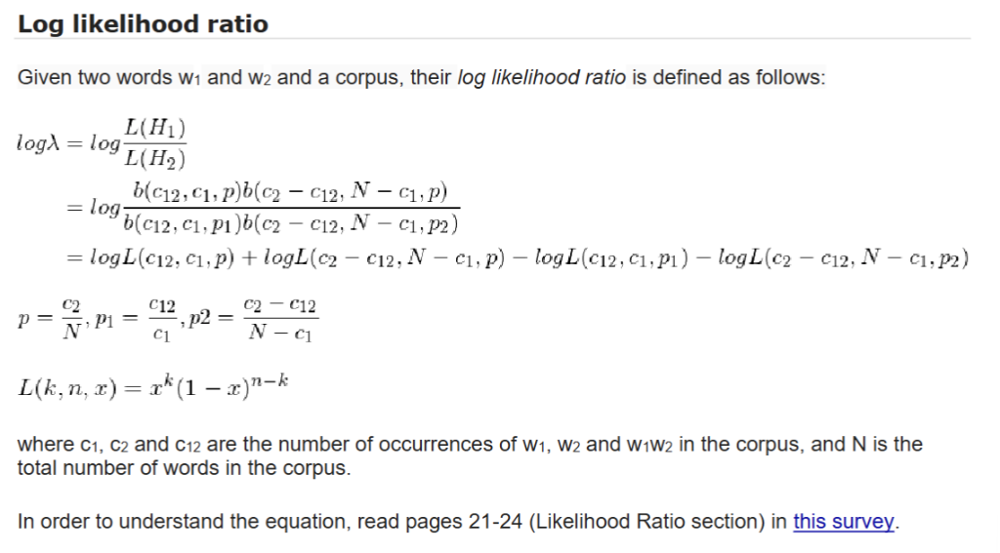

# Assignment 2 Content

## Assignment 2 - Collocation Extraction 
Due Date: 21/72  
Technical questions: Idan 
Conceptual questions: Meni 
## Abstract 
In this assignment you will automatically extract collocations from the Google 2-grams dataset using 
Amazon Elastic Map Reduce. 
## Collocations 
A collocation is a sequence of words that co-occur more often than would be expected by chance. 
The identification of collocations - such as 'crystal clear', 'cosmetic surgery', 'איכות סביבה '- is essential 
for many natural language processing and information extraction applications. 
In this assignment, we will use log likelihood ratio in order to determine whether a given pair of 
ordered words is a collocation. 
## Log likelihood ratio 
Given two words w1 and w2 and a corpus, their log likelihood ratio is defined as follows: 



$$
\begin{aligned}
\log \lambda &= \log \frac{L(H_1)}{L(H_2)} \\
&= \log \frac{b(c_{12}, c_1, p) b(c_2 - c_{12}, N - c_1, p)}{b(c_{12}, c_1, p_1) b(c_2 - c_{12}, N - c_1, p_2)} \\
&= \log L(c_{12}, c_1, p) + \log L(c_2 - c_{12}, N - c_1, p) - \log L(c_{12}, c_1, p_1) - \log L(c_2 - c_{12}, N - c_1, p_2)
\end{aligned}
$$

$$
p = \frac{c_2}{N}, \quad p_1 = \frac{c_{12}}{c_1}, \quad p_2 = \frac{c_2 - c_{12}}{N - c_1}
$$

$$
L(k, n, x) = x^k (1 - x)^{n-k}
$$
where c1, c2 and c12 are the number of occurrences of w1, w2 and w1w2 in the corpus, and N is the 
total number of words in the corpus. 
In order to understand the equation, read pages 21-24 (Likelihood Ratio section) in [this survey](https://nlp.stanford.edu/fsnlp/promo/colloc.pdf). 
## The Assignment 
Write a map-reduce program which produces the list of top-100 collocations for each decade (1990-
1999, 2000-2009, etc.) for English and Hebrew, with their log likelihood ratios (in descending order). 
The log likelihood ratios should be calculated with refer to [Google N-Grams](https://registry.opendata.aws/google-ngrams), specifically the bigram 
datasets for English and Hebrew  
▪ English: s3://datasets.elasticmapreduce/ngrams/books/20090715/eng-us-
all/2gram/data 
▪ Hebrew: s3://datasets.elasticmapreduce/ngrams/books/20090715/heb-all/2gram/data 

You might also use the unigram datasets: 
▪ English: s3://datasets.elasticmapreduce/ngrams/books/20090715/eng-us-
all/1gram/data 
▪ Hebrew: s3://datasets.elasticmapreduce/ngrams/books/20090715/heb-all/1gram/data 
A description of these files format can be found [here](https://storage.googleapis.com/books/ngrams/books/datasetsv3.html).

Your solution must avoid the generation of redundant key-value pairs. 
No assumption on the memory capacity can be made. In particular, you cannot assume that the word 
pairs of any decade, nor the set of pairs of a given word, nor a list of counts of unigrams etc, can be 
stored in memory. 
## Reports 
### Statistics 
You are required to provide the number of key-value pairs that were sent from the mappers to the 
reducers in your map-reduce runs, and their size (Hint: take a look at the log file of Hadoop), with and 
without local aggregation. 
### Analysis 
Provide 10 good and 10 bad examples (5 in Hebrew and 5 in English), you've manually collected from 
the system output. In the frontal checking you will be asked to say something on why wrong 
collocations were extracted (a manual analysis). 
## Stop Words 
Stop words are words which appear very frequently in the corpus. In many natural language 
processing algorithms, the stop words are filtered (think why). You are required to remove all bigram 
that contain stop words and not include them in your counts (a list of stop-words for English and 
Hebrew is provided in the assignment archive, feel free to find better lists in order to improve results): [eng-stopwords.txt](../eng-stopwords.txt), [heb-stopwords.txt](../heb-stopwords.txt).  
## Technical Stuff 
### Amazon Abstraction of Map Reduce 
Amazon has introduced two abstractions for its Elastic MapReduce framework and they are:  Job 
Flow, Job Flow Step. 
### Job Flow 
A Job Flow is a collection of processing steps that Amazon Elastic MapReduce runs on a specified 
dataset using a set of Amazon EC2 instances. A Job Flow consists of one or more steps, each of 
which must complete in sequence successfully, for the Job Flow to finish. 
### Job Flow Step 
A Job Flow Step is a user-defined unit of processing, mapping roughly to one algorithm that 
manipulates the data. A step is a Hadoop MapReduce application implemented as a Java jar or a 
streaming program written in Java, Ruby, Perl, Python, PHP, R, or C++. For example, to count the 
frequency with which words appear in a document, and output them sorted by the count, the first step 
would be a MapReduce application which counts the occurrences of each word, and the second step would be a MapReduce application which sorts the output from the first step based on the calculated 
frequenciess. 
### Example Code 
Here is a small piece of code to help you get started: 
 
```java
AWSCredentials credentials = new PropertiesCredentials(...); 
AmazonElasticMapReduce mapReduce = new AmazonElasticMapReduceClient(credentials); 
  
HadoopJarStepConfig hadoopJarStep = new HadoopJarStepConfig() 
    .withJar("s3n://yourbucket/yourfile.jar") // This should be a full map reduce application. 
    .withMainClass("some.pack.MainClass") 
    .withArgs("s3n://yourbucket/input/", "s3n://yourbucket/output/"); 
  
StepConfig stepConfig = new StepConfig() 
    .withName("stepname") 
    .withHadoopJarStep(hadoopJarStep) 
    .withActionOnFailure("TERMINATE_JOB_FLOW"); 
  
JobFlowInstancesConfig instances = new JobFlowInstancesConfig() 
    .withInstanceCount(2) 
    .withMasterInstanceType(InstanceType.M4Large.toString()) 
    .withSlaveInstanceType(InstanceType.M4Large.toString()) 
    .withHadoopVersion("2.6.0").withEc2KeyName("yourkey") 
    .withKeepJobFlowAliveWhenNoSteps(false) 
    .withPlacement(new PlacementType("us-east-1a")); 
  
RunJobFlowRequest runFlowRequest = new RunJobFlowRequest() 
    .withName("jobname") 
    .withInstances(instances) 
    .withSteps(stepConfig) 
    .withLogUri("s3n://yourbucket/logs/"); 
  
RunJobFlowResult runJobFlowResult = mapReduce.runJobFlow(runFlowRequest); 
String jobFlowId = runJobFlowResult.getJobFlowId(); 
System.out.println("Ran job flow with id: " + jobFlowId); 
```
Notice that order of commands matters. 
### Reading the n-grams File 
The n-grams file is in sequence file format with block level LZO compression. In order to read it, use 
the code: 
 
```java
Configuration conf = new Configuration(); 
Job job = new Job(conf, "..."); 
... 
job.setInputFormatClass(SequenceFileInputFormat.class); 
```
### Passing Parameters from the Main to the Mappers or Reducers 
You can use the "Configuration" object to pass parameters from the main to the mapper/reducer:  
- In order to set the value of the parameter: 
 
```java
Configuration jobconf = new Configuration();
jobconf.set("threshold", args[3]); 
//threshold is the name of the parameter - you can write whatever you 
like here, and arg[3] is its value in this case. 
```
 
- To get the value in the mapper/reducer we use the context to get the configuration and then 
take the parameter value from it: 
 
```java
context.getConfiguration().get("threshold","1") 
//"1" is the returned value if threshold has not been set. 
```
 
### Local single-node 
During the development, you can run your code locally on a single-node cluster of Hadoop, installed 
on your computer. 
The installation is quite simple: [Linux](https://hadoop.apache.org/docs/stable/hadoop-project-dist/hadoop-common/SingleCluster.html), [Windows](https://cwiki.apache.org/confluence/display/HADOOP2/Hadoop2OnWindows). 
## Additional Notes 
▪ Notice that some parts of the AWS SDK are deprecated due to SDK updates. It is okay to use 
these parts here. 
▪ If you choose not to install Hadoop locally, you must pay attention to the fees, especially since 
the instances that are required in EMR are not included in the ["Free Usage Tier"](http://aws.amazon.com/free/faqs/). For 
debugging purpose, it is recommended to choose the weakest instance possible (M4Large), 
and the lowest number instances to complete the job. In addition, start by testing your system 
on a small file, and only after you make sure all of the parts work properly, move to the big 
corpus. 
Consider every code you run, since each run is directly associated with money coming out of 
your budget! 
▪ Notice that EMR uses other different products of AWS to complete its job, particularly: ec2 
(management and computation) and S3 (storing logs, results, etc.). Make sure that every 
resource you have used is released /deleted after you're done. 
 
## Grading 
 
▪ The assignment will be graded in a frontal setting. 
▪ All information mentioned in the assignment description, or learnt in class is mandatory for the 
assignment. 
▪ You will be reduced points for not reading the relevant reading material, not implementing the 
recommendations mentioned there, and not understanding them. 
▪ Students belonging to the same group will not necessarily receive the same grade.  
▪ All the requirements in the assignment will be checked, and any missing functionality will 
cause a point reduction. Any additional functionality will compensate on lost points. Whatever 
is not precisely defined in the assignment, you have the freedom to choose how to implement 
it. 
▪ You should strive to make your implementation as scalable and efficient as possible, in terms 
of: time, memory, and money. 
## Submission 
Submit a zip file that contains: (1) all your sources (no need to submit the jars); (2) the output 
mentioned above, OR a link to the output directory on S3 in the README file; (3) The required 
reports. Include a file called README that contains your usernames, names, ids, how to run the 
project, and any notes regarding your implementation or/and your map-reduce steps. 

